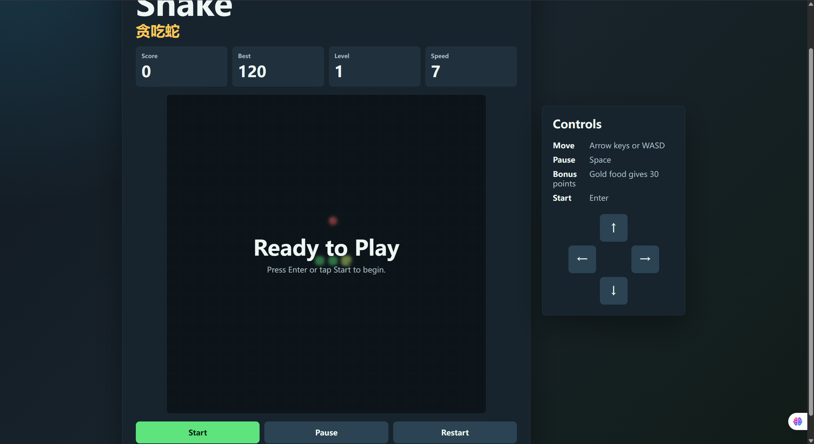
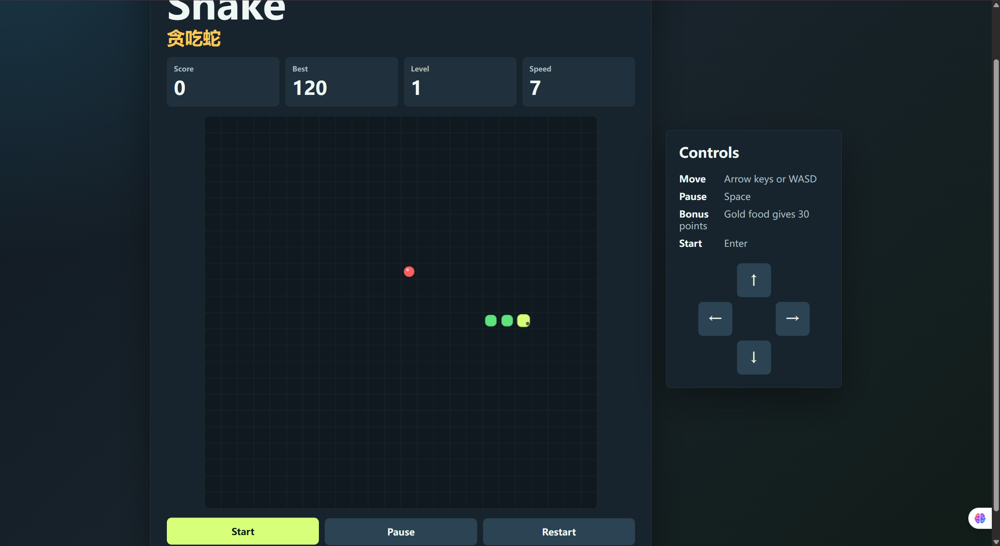
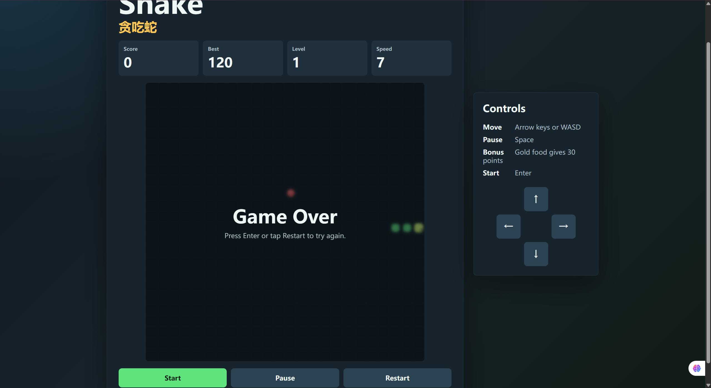

# Snake / 贪吃蛇

一个使用单个 HTML 文件实现的浏览器版贪吃蛇游戏。项目无需安装依赖，打开 `index.html` 或启动本地静态服务即可游玩。

## 效果预览

### 准备开始



### 游戏进行中



### 游戏结束



## 运行方式

推荐在项目目录启动本地静态服务：

```bash
python -m http.server 5188
```

然后在浏览器打开：

```text
http://127.0.0.1:5188
```

也可以直接打开：

```text
index.html
```

## 操作说明

- 移动：方向键或 WASD
- 暂停 / 继续：空格键
- 开始：Enter 键或 Start 按钮
- 重新开始：游戏结束后按 Enter 键，或点击 Restart 按钮
- 触屏操作：点击屏幕方向按钮，或在棋盘上滑动

## 文件结构

- `index.html`：包含完整页面结构、样式和游戏逻辑
- `.gitignore`：忽略本地工具状态、依赖目录、构建产物和日志文件

## 功能特性

- Canvas 绘制游戏棋盘
- 显示当前分数、最高分、等级和速度
- 分数提升后速度逐渐加快
- 每吃第 5 个食物会出现金色奖励食物，获得额外分数
- 支持键盘、按钮和滑动控制
- 支持开始、暂停、继续、游戏结束和重新开始状态
- 使用本地存储保存最高分
- 适配桌面和移动端屏幕
- 包含轻量音效反馈
